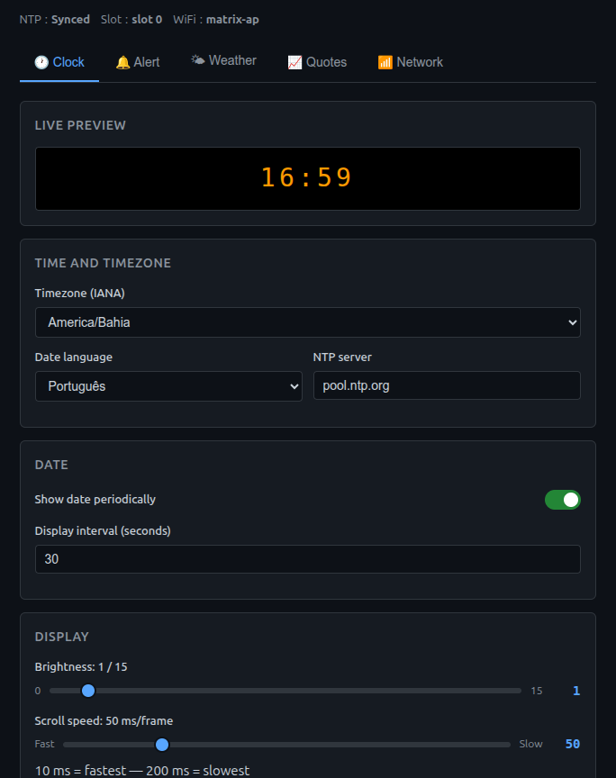
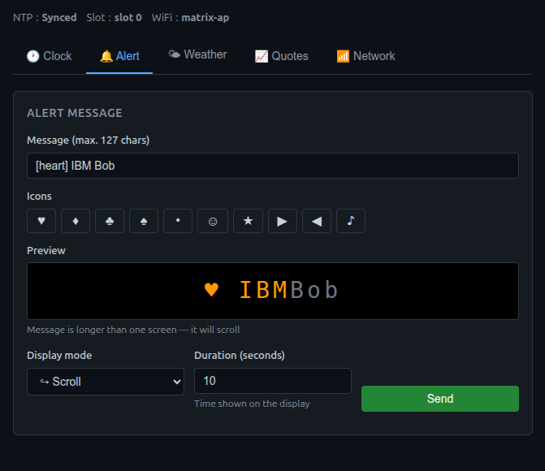
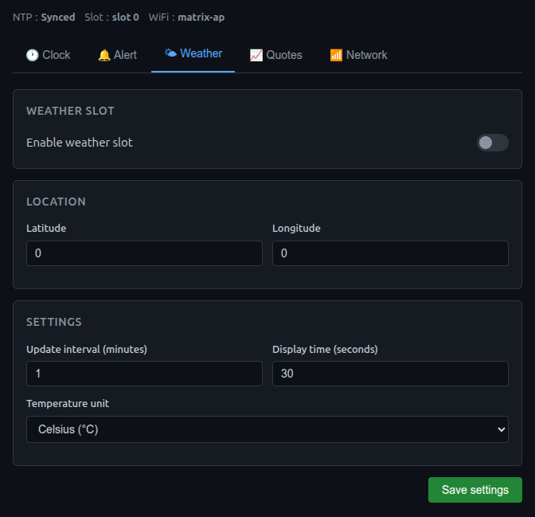
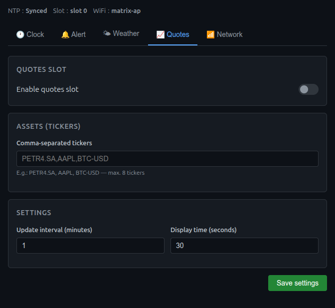

# Smart Matrix Clock

Arduino/ESP32 firmware for a MAX7219 LED matrix clock with WiFi, web panel and REST API — built entirely with the **[IBM Bob](https://www.ibm.com/products/ibm-bob)** assistant.

> **Repository purpose:** demonstrate the use of IBM Bob as an embedded software development agent, from architecture planning through code generation and review for a real C++ Arduino/ESP32 project.

---

## About the project

**Smart Matrix Clock** is a non-blocking ESP32 firmware that displays information on 4 chained MAX7219 FC16 modules (32×8 LEDs). The device connects to WiFi, synchronises time via NTP and enters a user-configurable automatic slot rotation.

### Features

| Slot | Description |
|---|---|
| 🕐 **Clock** | Continuous base mode — `HH:MM` with blinking colon, date in periodic scroll |
| 🔔 **Alert** | One-off message sent via REST API or web panel, displayed once then discarded |
| 🌤️ **Weather** | Temperature, condition and min/max of the day via [Open-Meteo](https://open-meteo.com/) (no API key required) |
| 📈 **Quotes** | Price and percentage change of configurable assets via Yahoo Finance |

### Technical highlights

- **Fully non-blocking** — no `delay()` in `loop()`; all timing uses `millis()`
- **Async HTTP server** — handlers only update state variables; I/O happens in `loop()`
- **NVS persistence** — settings survive reboots via ESP32 `Preferences`
- **Setup AP** — when no WiFi credentials are saved, automatically opens `SmartMatrixClock-Setup` AP
- **Factory reset** — BOOT button (GPIO 0) held at power-on wipes all settings

---

## Screenshots

| Clock | Alert |
|---|---|
|  |  |

| Weather | Quotes |
|---|---|
|  |  |

---

## Hardware

| Component | Detail |
|---|---|
| Microcontroller | ESP32 Dev Module |
| Display | 4× MAX7219 FC16 8×8 chained (32 columns × 8 rows) |
| Interface | Hardware SPI (VSPI) |
| CLK pin | GPIO 18 |
| DATA/MOSI pin | GPIO 23 |
| CS pin | GPIO 5 |
| Factory reset | BOOT button — GPIO 0 (active LOW) |

---

## Repository structure

```
smart-matrix-clock-esp32/
├── smart-matrix-clock-esp32.ino  ← main sketch (setup + loop)
├── config.h                      ← pins, constants, defaults, NVS keys
├── globals.h / globals.cpp       ← shared state between modules
├── display.h / display.cpp       ← rendering, scroll, blink, slot rotation
├── wifi_manager.h / .cpp         ← WiFi connection, setup AP, deferred restart
├── ntp.h / ntp.cpp               ← NTP sync and periodic re-sync
├── text_encoding.h / .cpp        ← UTF-8 ↔ Latin-1
├── locale_data.h / .cpp          ← day/month names, IANA → POSIX TZ table
├── persistence.h / .cpp          ← NVS load/save, applyTimezone, factoryReset
├── web_page.h / web_page.cpp     ← self-contained HTML/CSS/JS page (string literal)
├── web_routes.h / web_routes.cpp ← ESPAsyncWebServer route registration
└── data_fetcher.h / .cpp         ← external HTTP fetch (Weather, Quotes), cache
docs/
├── api-rest.md                   ← complete REST API reference
├── project-spec.md               ← full product specification
└── implementation-plan.md        ← 5-phase implementation plan
```

---

## Build & Flash

Board FQBN: `esp32:esp32:esp32`

```bash
# Verify (no device required)
arduino-cli compile --fqbn esp32:esp32:esp32 smart-matrix-clock-esp32

# Flash to device
arduino-cli upload --fqbn esp32:esp32:esp32 --port /dev/ttyACM0 \
  --upload-property upload.speed=115200 smart-matrix-clock-esp32

# Serial monitor (115200 baud)
arduino-cli monitor --port /dev/ttyUSB0 --config baudrate=115200
```

### Required libraries

```bash
arduino-cli lib install "MD_MAX72XX" "MD_Parola" "ESP Async WebServer" "AsyncTCP" "ArduinoJson"
arduino-cli core install esp32:esp32
```

| Library | Version |
|---|---|
| `MD_MAX72XX` | 3.5.1 |
| `MD_Parola` | 3.7.5 |
| `ESP Async WebServer` | 3.11.2 |
| `Async TCP` | 3.5.0 |
| `ArduinoJson` | 7.4.3 |

---

## REST API

All endpoints are served directly by the ESP32 on port **80**.
No authentication is required on any endpoint in this version — anyone on the same network as the device can call them. An API-key mechanism was implemented and later removed after it locked the web panel out of its own write actions; see [`docs/enhancements-plan.md`](docs/enhancements-plan.md) (Sub-Task 3) for the planned replacement.

| Method | Route | Description |
|---|---|---|
| `GET` | `/` | Web panel (self-contained HTML) |
| `GET` | `/api/status` | Current time, active slot, NTP synced, SSID, IP |
| `GET` | `/api/config` | All current settings (JSON) |
| `GET` | `/api/timezones` | List of available IANA timezones |
| `POST` | `/api/config` | Update settings |
| `POST` | `/api/alert` | Send an alert message to the display |
| `POST` | `/api/wifi` | Save new WiFi credentials and reboot |

**Example — send alert:**
```bash
curl -X POST http://<ip>/api/alert \
  -H "Content-Type: application/json" \
  -d '{"message": "Deploy complete!"}'
```

Full documentation: [`docs/api-rest.md`](docs/api-rest.md)

---

## Implementation plan

The firmware was developed in **5 incremental phases**, each delivering a functional and hardware-testable product:

| Phase | Description | Status |
|---|---|---|
| 1 | Project skeleton + functional clock (NTP, blink) | ✅ Done |
| 2 | NVS persistence + configurable WiFi + setup AP | ✅ Done |
| 3 | Web interface + REST API + full clock (date, alert) | ✅ Done |
| 4 | Weather slot (Open-Meteo) + slot rotation | 🔲 Pending |
| 5 | Quotes slot (Yahoo Finance) | 🔲 Pending |

Details in [`docs/implementation-plan.md`](docs/implementation-plan.md).

---

## About IBM Bob

This repository was created as a demonstration of **IBM Bob** — IBM's software development assistant — applied to a real embedded firmware project.

IBM Bob was used at every stage:
- Architecture and module design
- C++ code generation and review (Arduino/ESP32)
- Creation of the self-contained web page served by the ESP32
- Refactoring and project renaming
- Generation of this documentation

---

## License

MIT
